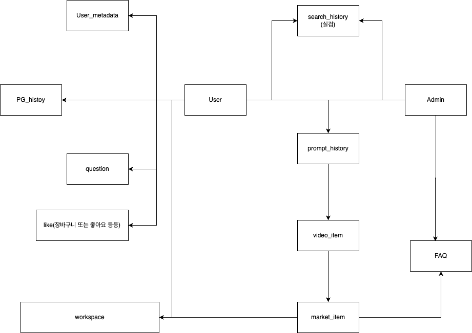
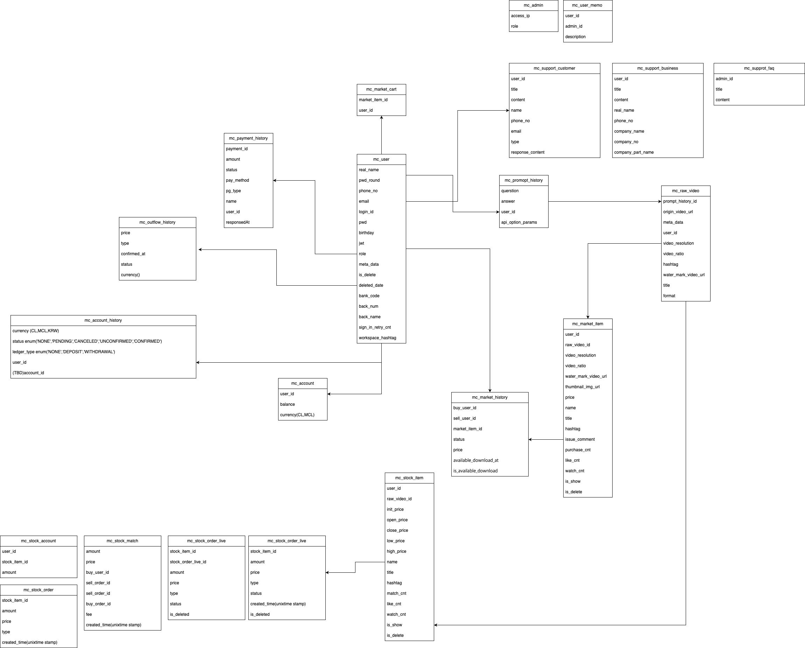
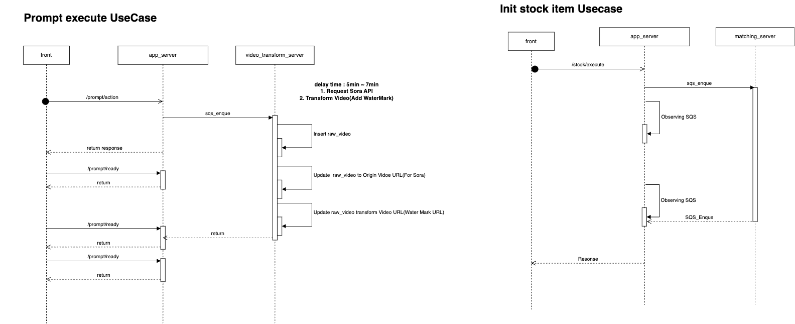

# 생성형 T2V AI 기반 영상/지분 거래 플랫폼

기간: 2024년 4월 1일 → 2025년 1월 30일

## Overview

본 프로젝트는 생성형 T2V(Text-to-Video) AI 모델을 기반으로 사용자가 직접 영상을 생성하고, 해당 영상 또는 영상 지분을 거래할 수 있는 **영상/지분 거래 플랫폼**을 구축한 사이드 프로젝트입니다.

특히, 지분 기반 수익 분배 기능과 실시간 체결 시스템을 도입하여 기존 콘텐츠 거래 시스템에서 한발 더 나아간 실험적 모델을 적용하고자 하였습니다.

단순한 기술 검증이 아닌, **실제 운영 가능한 B2C 서비스 수준의 개발**을 목표로 하며, 기획자, 디자이너 등 다양한 직군과의 협업을 통해 실무 커뮤니케이션 능력과 설계 유연성을 동시에 향상시키기 위해 본 프로젝트를 진행하게 되었습니다.

현재는 다양한 기술 이슈를 발생 및 해결을 반복하고 , 테스트 환경을 통해 안정성을 검증 중에 있습니다.

---

## 구성원

기획자 2명 , 디자이너 1명 , 퍼블리셔 1명 , 개발자 1명

---

## 기술 스택

- FrontEnd : `NuxtJS` , `VueJS` , `Pinia`
- BackEnd : `NestJS` , `TypeORM` , `MySQL`
- Infra : `AWS ECS` , `AWS ECR` , `AWS RDS` , `AWS SQS` , `AWS SNS` , `AWS S3`

---

## 핵심 기능

- **생성형 T2V AI 모델을 통한 영상 생성 기능 제공**
- **생성된 영상의 후처리 및 클라우드 저장 구조 설계**
- **이용자 간 영상 및 지분 거래 기능**
- **지분에 따른 수익 분배 및 실시간 체결 기능 구현**
- **지분 거래 내역 기록 및 체결 상태 알림 시스템**

---

## 주요 업무

- T2V 모델 API 연동 및 후처리 영상 처리 로직 개발
- 영상 저장, 워터마크 적용 등 Cloud Storage 기반 저장 구조 설계
- NestJS 기반 MSA 구조 및 Message Queue 통신 설계
- AWS ECS 기반 배포 및 Terraform을 통한 인프라 구성 자동화
- 지분 거래의 실시간성 확보를 위한 SQS, SNS 이벤트 설계 및 개발

---

## 아키텍처 및 설계

### 아키텍처 및 설계 개요

1. Infra structure
2. Data Structure
3. Message Queue Structure
4. Directory Structure

### **Infra Structure**

.png>)

MVP Infra Struture

.png>)

최종 오픈 Infra Struture

**네트워크 보안 및 구성**

- AWS VPC를 활용하여 Public Zone과 Private Zone을 분리
- 웹 애플리케이션은 Public Subnet에, 백엔드/DB는 Private Subnet에 배치
- 최소한의 외부 노출을 위해 Bastion Host를 구성하여 관리자 접근 경로를 제한

**MonoRepo 기반 MSA 도입**

- NestJS 기반의 MonoRepo 구조로 설계되었으며, 기능별로 MSA 구조를 점진적으로 분리하는 전략을 채택
- **서비스 목적성과 트래픽 규모에 따라 독립적 모듈로 분리**
- 서비스 간 의존성을 줄이고 기능 단위 확장이 가능

**배포 구조**

- 개발 초기 예산 제한으로 인한 CI/CD 도구 제한

→ Cloud Computer(가상 서버)에 직접 SSH 접속하여 수동으로 빌드 및 PM2를 활용한 배포

- MVP 개발후 CI/CD 자동화 전환을 위한 팀 내 협의를 통해 GitHub Actions + AWS ECS/ECR 기반의 자동 배포 환경 구축 진행

### **Data Structure**

**도메인 기반 설계**

- ERD 설계 이전 , 요구사항을 정리한 뒤 **도메인 모델을 추상화**
- **기획서와 개발 관점의 용어를 통일하여 혼선 최소화**

**비정규화 → 정규화 반복 구조**

- 초기 설계시 비정규화된 구조로 Entity를 구성
- 시스템 안정성과 확장성을 고려하여 **정규화를 반복 수행**
- **이용자(User), 자산(Account), 지분(stock_account), 거래(Transaction)** 등 핵심 테이블은 사후 수정이 어려운 만큼 기획자와 긴밀한 커뮤니케이션을 통해 요구사항을 명확히 고착화한 후 설계

### **Message Queue Structure**

**메시지 기반 처리의 필요성 도출**

- 기능 구현 전 **Sequence Diagram을 통해 메시지 흐름을 도식화**
- 서비스 간 실시간성과 비동기 처리를 위한 **MQ(Message Queue)의 필요성을 사전 검토**

**Redis Pub/Sub → AWS SQS/SNS 구조로 확장**

- 초기에는 간단한 구조 검증을 위해 Redis 기반의 Pub/Sub 모델을 테스트
- 실제 서비스 운영 단계에서는 AWS 환경에 적합한 **SQS(FIFO Queue)와 SNS(Broadcasting)** 구조로 전환

**송·수신 규약 및 메시지 포맷 설계**

- 시스템 간 통신에 사용되는 메시지 형식은 **JSON 기반으로 표준화**
- 이벤트명, 이벤트 타입, 발신자 ID, 수신 대상, 페이로드 등의 구조를 명확히 정의

**유즈케이스 분리와 부하 분산**

- 주문 체결/알림/상태 저장 등의 기능을 MQ를 통해 **각기 다른 컨슈머에서 분산 처리**할 수 있도록
  **복수 이벤트로 세분화하여 구현**

### Directory Structure

**MSA 기반 서비스 분리 및 코드 구조화**

- 서버 사이드 구조는 NestJS의 **MonoRepo 기반으로 설계**
- {component}-main.js를 통한 서버 구동

---

## **기술적 이슈 및 해결 과정**

- **생성형 T2V AI 영상 처리 지연 및 저장 구조 문제**
  - **이슈 배경**
    생성형 T2V 모델을 통해 받은 응답을 기반으로 원본 영상과 워터마크 영상 두 개를 생성하고 저장하는 구조였으며, FFMPEG을 활용한 후처리 및 Cloud Computer의 저장소 → S3 마운트 방식으로 구현되어 있습니다.
    이 과정에서 다음과 같은 문제들이 발생하였습니다.
    - T2V 응답 속도가 모델마다 크게 다르고, 응답 지연 시 이용자 대기 시간 증가
    - Cloud Computer 자원 과다 사용으로 인한 CPU/RAM 병목
    - S3를 직접 Mount한 구조의 불안정성 (서버 장애 시 원본 유실 위험)
  - **해결 과정**
    - 영상 저장 과정을 분리하여 MQ기반 **비동기 병렬 처리 방식** 도입
    - pulling 방식으로 영상 생성 완료 시점까지 사용자 브라우저에 상태를 기록하는 **브라우저 캐시 기반 상태 동기화** 구조 실험
    - S3 Mount 대신 스트림 방식을 S3 업로드
    - FFMPEG 후처리 로직을 별도 워커 프로세스로 분리하여 메인 프로세스 자원 부담 최소화
    - T2V 응답 상태를 실시간으로 표시하기 위해 **WebSocket 기반 상태 알림 구조** 적용 검토
  - **예상 성과**
    - 영상 생성 속도와 사용자 응답 시간 간격을 유연하게 분리 / 서버 자원 안정성 확보 및 예상치 못한 장애 대응력 향상
    - 사용자 경험(UX) 측면에서 **생성 중 상태 안내와 실시간 알림 제공 가능성 확보**
- **지분 체결 로직 복잡도 및 실시간성 이슈**
  - 이슈 배경
    지분 체결 시 발생하는 주문 생성, 주문창 갱신, 상태 동기화, 알림 발송 등 다양한 유즈케이스가 **하나의 서버 내 동기 처리**로 운영되며 부하 집중 및 체결 대기 시간 발생하였습니다.
    MQ 도입은 데이터 동시성 및 순서 보장을 위한 선택이었지만, 모든 기능을 MQ로 처리하며 **복잡도가 상승하고 실시간성이 저하되는 문제**가 발생.
  - **해결 과정**
    - AWS SQS (FIFO) 기반 메시지 큐를 도입하여 순서를 보장하고 트랜잭션 무결성 유지
    - **주문/체결 처리와 알림 로직을 유즈케이스 단위로 분리**하여 컨슈머 독립 처리
    - SNS로 브로드캐스트 전환하여 병목 분산
    - SNS → SQS 구조를 활용하여 단방향 전달은 간결하게, 주요 데이터는 큐로 일괄 처리
  - **성과**
    - 실시간 거래 체결 흐름 안정화
    - 기능별 부하 분산 처리로 시스템 응답 속도 개선
    - MQ 의존성 구조 최적화로 복잡도 완화
- **서버 운영 비용 이슈로 인한 인프라 구축 방식 전환**
  - **이슈 배경**
    사이드 프로젝트 특성상 상시 서버 운영이 불필요하였고, 최소 비용으로 테스트 환경을 구성하고 일정 종료 시 인프라를 제거해야했고, 반복되는 수동 구축 작업은 비효율적이고 오류가 자주 발생하였습니다.
  - **해결 과정**
    - 테스트 주기 종료 시 **인프라 리소스를 자동 제거**하는 정책 채택
    - Terraform을 도입하여 VPC, EC2, RDS, SQS 등 **전체 인프라를 코드로 관리**
    - 수동 작업 없이 동일한 환경을 빠르게 재구성 가능
  - **성과**
    - 인프라 셋업 및 해제 소요 시간 최소화
    - 비용 최적화 달성 및 **IaC 기반 유연한 환경 전환 가능**

---
